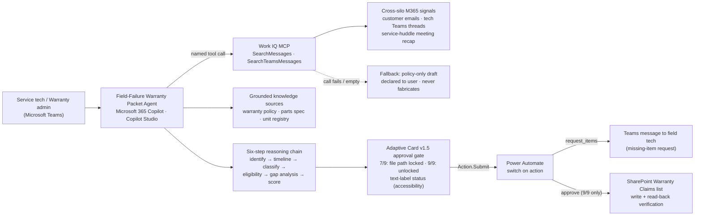

# Field-Failure Warranty Packet Agent

> **Microsoft Agents League @ AI Skills Fest 2026 — Enterprise Agents track (Microsoft 365 Copilot)**
> Built solo in Copilot Studio. Integrates **Work IQ via the Work IQ MCP** as a named orchestration tool.

Reconstructs warranty claims from scattered M365 signals — customer emails, technician Teams threads, service-huddle Teams meeting notes — checks policy eligibility, flags documentation gaps, and produces a cited packet for human approval before filing.

**Demo video:** _[YouTube link — added at submission]_

---

## The problem

When a hydraulic walking-floor trailer fails in the field, the warranty claim packet is a scavenger hunt. The customer emails service. The field technician posts updates in a Teams thread. The service team discusses it in a huddle. The serial number is in one system, the operating hours in another, and the warranty policy lives in a PDF nobody reads end-to-end.

Reconstructing the full claim takes hours per failure — and packets routinely bounce back over one missing photo, one absent hour-meter reading, or one citation to the wrong policy clause. This agent's job is simple: **no claim gets rejected on first submission.**

## What it does

Given a single trigger ("Customer reports Trailer 12's floor stopped cycling"), the agent runs a six-step reasoning chain:

1. **Identify** — resolves the trailer to one serial via the unit registry; scopes to exactly that unit and **explicitly discards a decoy email** about a different trailer.
2. **Timeline** — in-service date (registry) + failure date (customer email) → months in service.
3. **Classify** — reads the tech's narrative against policy §2 exclusions and spec §3.2 failure signatures. Assessment only, never asserted as fact.
4. **Eligibility** — covered component? Within the coverage window?
5. **Gap analysis** — compares assembled evidence to the 9-item documentation checklist; lists every missing item.
6. **Score & flag** — completeness (X/9), eligibility verdict, exclusion-risk note.

Every fact is cited to its source signal. The result renders as an Adaptive Card approval gate: at 7/9 the **Approve & File button is disabled** and the live path is *Request Missing Items*; once the tech supplies the gaps and the claim re-scores 9/9, the file path unlocks. Approval writes the claim to a SharePoint list with read-back verification. A human makes every final determination.

## Work IQ integration (the IQ-layer requirement)

Work IQ is the intelligence layer behind Microsoft 365 Copilot — it builds memory from emails, meetings, chats, and documents. This agent surfaces it through the **Work IQ MCP, added as a named tool in Copilot Studio** and invoked as a discrete, visible orchestration step (`SearchMessages`, `SearchTeamsMessages`). The integration is demonstrated by its **output and citations** — which cross-silo signals it pulled — and by the agent's behavior when retrieval is incomplete:

- **Cross-signal proof:** the claim packet cites customer email + tech Teams threads + the service-huddle recap — a result a single-connector agent cannot reach.
- **Discernment proof:** a deliberately planted decoy email (a parts reorder for a *different* trailer) is retrieved and correctly excluded, with the exclusion stated in the output.
- **Fallback proof:** if the Work IQ MCP call fails or returns nothing, the agent degrades to a policy-only draft, tells the user it couldn't reach live context, and never fabricates.

## Architecture

A standalone copy lives at [`docs/architecture.mermaid`](docs/architecture.mermaid).

## Reliability & safety

- **Two-layer filing gate** — the card disables Approve & File while items are missing (`isEnabled` on the action), and the topic re-checks the same condition server-side before the flow runs. The card is never the only enforcement.
- **Human-in-the-loop** — no claim is filed without explicit approval; the approver's identity is captured at decision time, never pre-populated.
- **No fabrication** — absent items are output as `MISSING — <where to get it>`, never invented. Causation is always framed as "consistent with, pending review."
- **Exclusion risk surfaced, not hidden** — even when it weakens the claim.
- **Permission-trimmed retrieval** — Work IQ MCP returns only what the signed-in user can already see.
- **Telemetry without Azure** — Copilot Studio analytics, Power Automate run history, and the SharePoint list itself as the audit record.

## Accessibility

- Status is carried by **text labels first** (NEEDS REVIEW, MISSING, PASS) — color is reinforcement, never the only signal; ✓/✕ glyphs accompany every color cue.
- FactSet and simple column layouts over decorative structure; logical reading order for screen readers.
- Plain-language verdicts and gap instructions ("Photograph the bagged seal on-site").

## Repository map

| Path | Contents |
|---|---|
| `agent/instructions.md` | Full agent instruction set (reasoning chain, two-tier output contract, guardrails) |
| `agent/adaptive-card-approval.pfx.txt` | Approval card — Power Fx formula, Adaptive Card v1.5 |
| `docs/architecture.mermaid` | Architecture diagram source |
| `docs/screenshots/` | Card states: 7/9 locked, 9/9 unlocked, fallback |
| `data-synthetic/` | The complete synthetic evidence bundle (see disclaimer) |
| `flows/warranty-claim-actions.md` | Power Automate flow design: switch on `action`, request-items branch, approve branch with read-back + error path |

## Rebuilding it

1. **Copilot Studio:** create an agent; paste `agent/instructions.md` as instructions.
2. **Knowledge:** upload the three knowledge files from `data-synthetic/` (policy, spec excerpt, unit registry).
3. **Work IQ MCP:** add it as a tool to the agent (requires a Microsoft 365 Copilot license; first use triggers a connection-consent card — approve it with delegated auth).
4. **Seed the signals:** the emails, Teams threads, and huddle recap in `data-synthetic/` must exist as *real messages/meetings in your demo tenant* — Work IQ retrieves live signals, not repo files. Allow time for indexing.
5. **Approval card:** in the Warranty Claim topic, add an Adaptive Card node and paste `agent/adaptive-card-approval.pfx.txt` (Formula mode).
6. **Actions:** create the SharePoint list (multi-line text columns for long fields — single-line truncates at 255 chars) and the Power Automate flow per `flows/warranty-claim-actions.md`.

## Synthetic data disclaimer

**Everything in this repository is synthetic.** Contoso Material Handling, GlideFloor, Redpoint Freight, all personas (Dale Brunner, Marco Reyes, Janelle Okafor, Priya Nair), serials, part numbers, policies, and records are fictional and built for this contest. All email addresses use the reserved `.example` domain. The failed-seal evidence photo is AI-generated synthetic imagery. No real employer data, customers, or personnel appear anywhere in this project.

> Demonstrated on a hydraulic walking-floor trailer — but the architecture (cross-signal evidence assembly, checklist gap analysis, gated filing) applies to any manufacturer processing field-failure warranty claims.

## License

MIT — see [LICENSE](LICENSE).
